# airbnb-base 和 eslint:recommended 对比

以下截图来自`openerp-console`和`cloud-processing`项目，其中`openerp-console`使
用`eslint:recommended`,`cloud-processing`使用`airbnb-base`。

> 以下对比来自两个项目的一部分，实际上的差异比截图展示出来的更大。很多不符合规范的代码`eslint:recommended`并没有检测出来

## 1 变量声明

**airbnb 规范：一直使用 const 来声明变量，一直使用 const 来声明变量。**

在 eslint:recommended 中不会检测这条规则，而在 airbnb-base 不符合这条规则中会报错。 _recommended 规则_

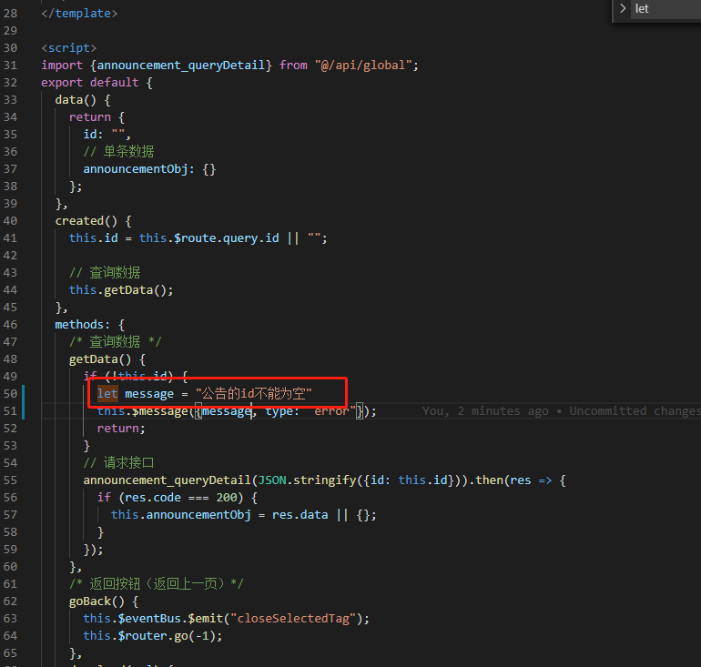

_airbnb 规则_

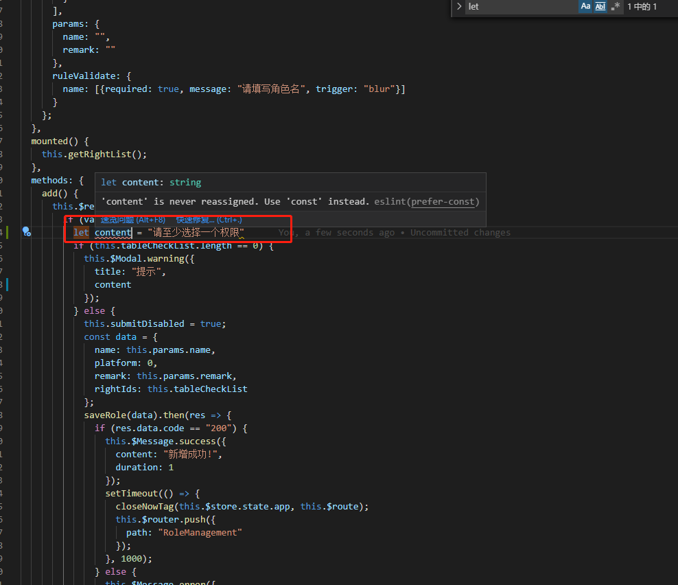

## 2 使用对象方法的缩写和属性值的简写

_recommended 规则_

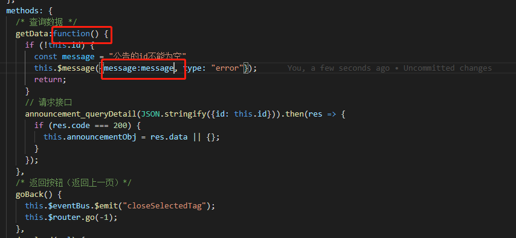

_airbnb 规则_

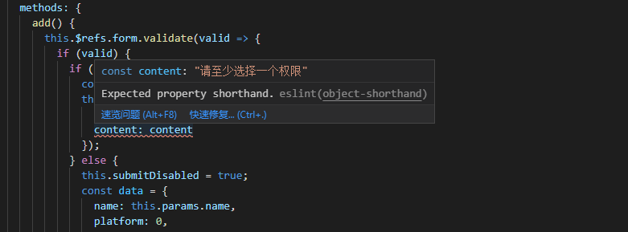

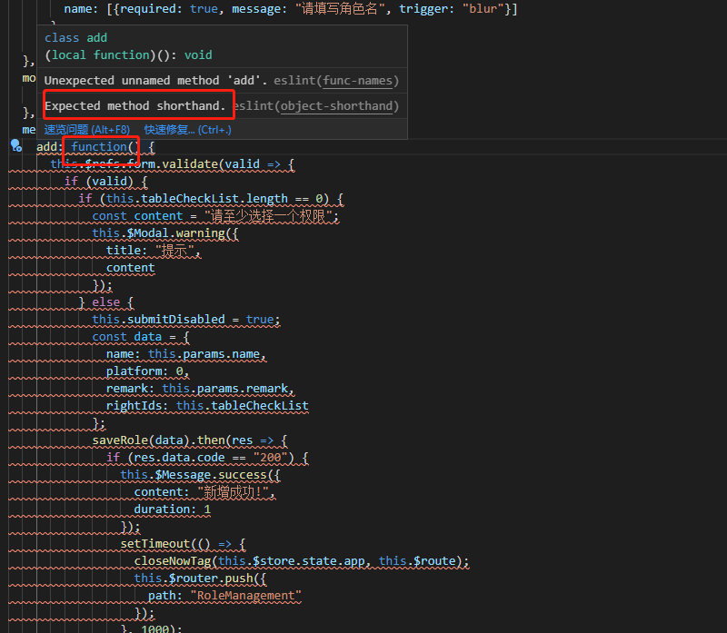

## 3 解构

_recommended 规则_

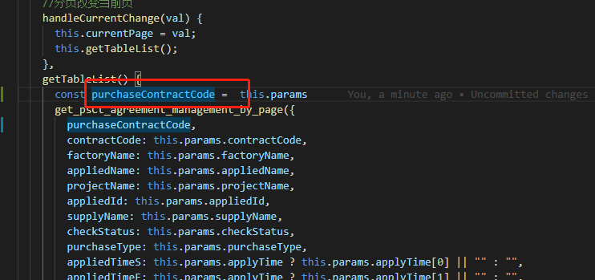

_airbnb 规则_

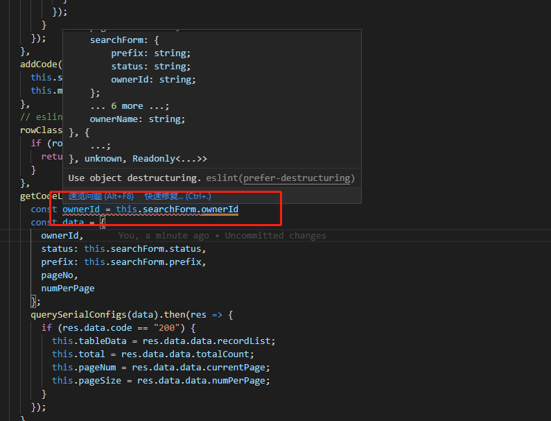

## 3 模板字符串

_recommended 规则_

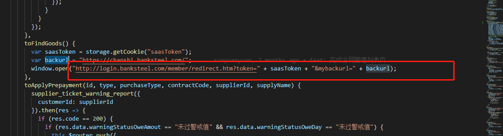

_airbnb 规则_

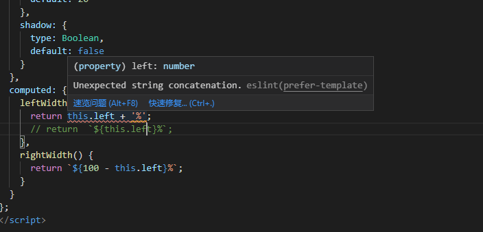

## 4 不要使用 arguments，可以选择 rest 语法 ... 替代

_recommended 规则_

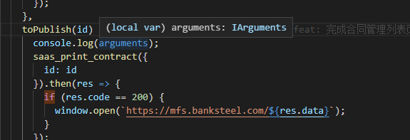

_airbnb 规则_

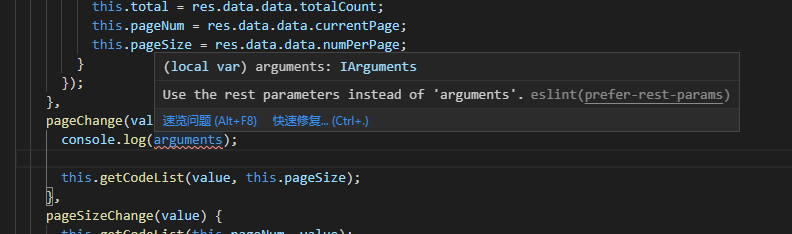

## 5 如果一个函数适合用一行写出并且只有一个参数，那就把花括号、圆括号和 return 都省略掉。如果不是，那就不要省略

_recommended 规则_

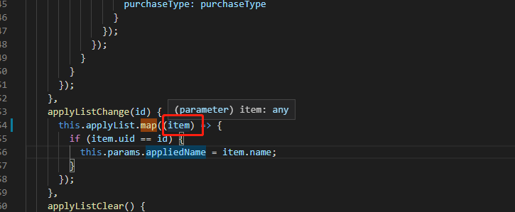

_airbnb 规则_

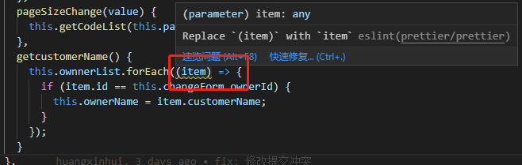

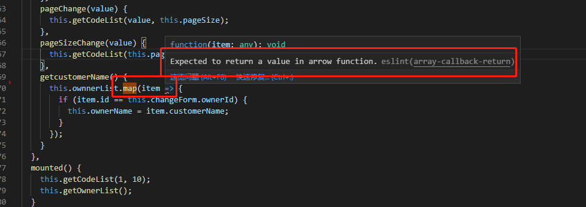

上面的截图还有个问题，`map`函数使用不当，只把`map`当成遍历而没有考虑到`map`真正的功能和它的语义化。在`airbnb`规则里会指
出这一点

## 6 模块

_recommended 规则_

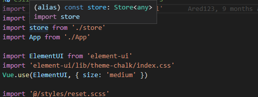

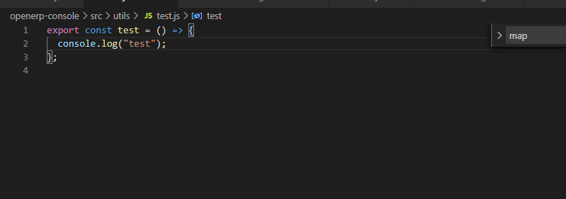

_airbnb 规则_

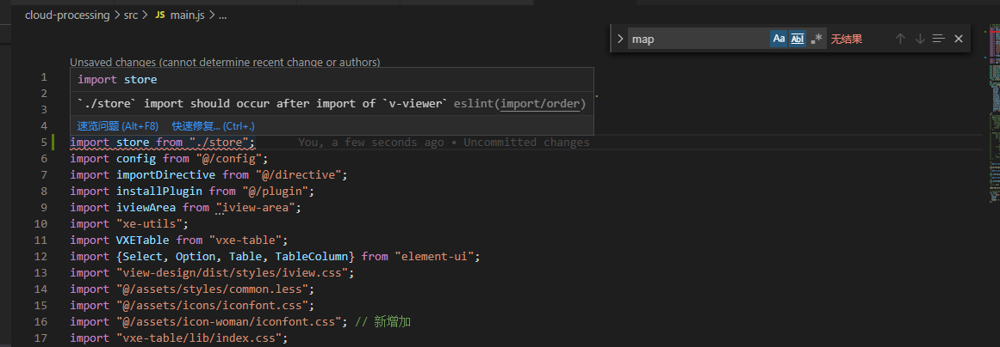

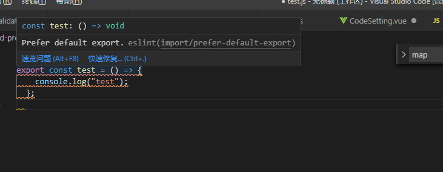

## 7 属性

_recommended 规则_

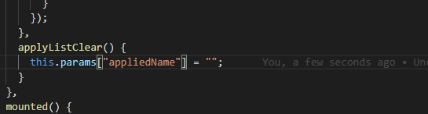

_airbnb 规则_

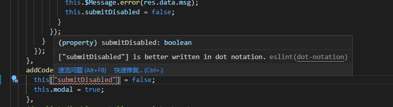

## 8 命名规则

_recommended 规则_

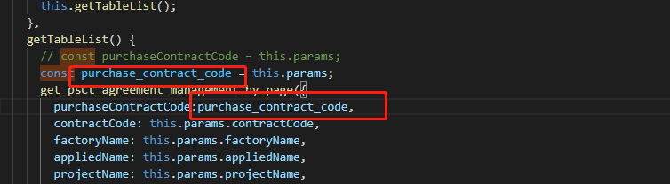

_airbnb 规则_

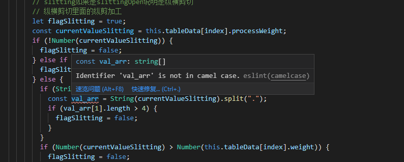

使用`eslint:recommended`和`airbnb-base`两种规则的对比发现，`eslint:recommended`对`airbnb`的 90%规范都做不了检测，

**开发人员只能依靠自觉来写代码。即使没有遵守规范，在没有`codereivew`下也发现不了。**

而使用`airbnb-base`规则可以检测出大部分不符合`airbnb`规范的代码。而且只需要在`vscode`装好`eslint`插件，很多不符合规范的
代码可以在保存文件时帮助开发者自动格式化出符合代码的规范，这样并不会增加多少开发成本。

[规范参考](https://www.kancloud.cn/kancloud/javascript-style-guide/43147)
